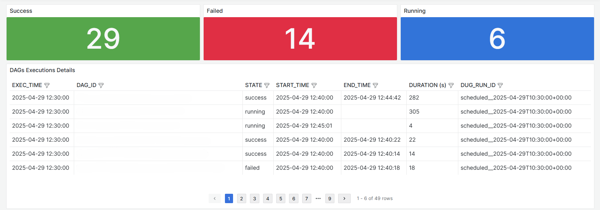
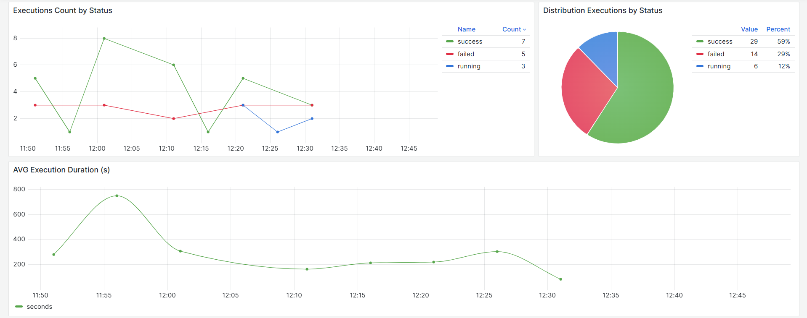
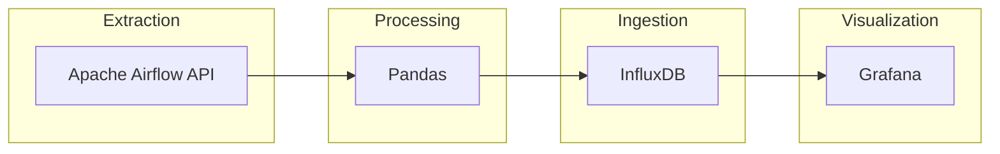

# airflow-monitoring


> A lightweight monitoring tool for Apache Airflow built with official REST API and Python




The DAG_ID column values ​​are not shown for privacy reasons.

## Table of Contents

* [Description](#description)
* [Features](#features)
* [Architecture](#architecture)
* [Technologies Used](#technologies-used)
* [Setup](#setup)
    * [Installation](#installation)
    * [Configuration](#configuration)
    * [Usage](#usage)
* [License](#license)

## Description

This project uses the official Apache Airflow API and Python to monitor workflows. The extracted data is loaded into InfluxDB and optionally Grafana can be used to visualize it through custom dashboards.

## Features

- Automatic extraction of DAGs and executions via Airflow REST API
- Data processing and normalization with Pandas
- Data ingestion to InfluxDB in time-series format
- Data visualization on Grafana (optional)

## Architecture



## Technologies Used

- [Apache Airflow](https://airflow.apache.org/)
- [Python](https://www.python.org/)
- [Pandas](https://pandas.pydata.org/)
- [InfluxDB](https://www.influxdata.com/)
- [Grafana](https://grafana.com/)

## Setup

### Installation

1. **Clone the repository**:
    ```bash
    git clone https://github.com/fabydag19/airflow-monitoring.git
    ```

2. **Navigate to the project directory**:
    ```bash
    cd airflow-monitoring
    ```

3. **Install dependencies**:
    ```bash
    pip install -r requirements.txt
    ```

### Configuration

Modify the files at ```config``` to match your Airflow and InfluxDB setup. For example with ```config.ini```:

```ini
[airflow]
dags_list_url = https://airflow/api/v1/dags?offset=
dags_exec_url = https://airflow/api/v1/dags/~/dagRuns/list?offset=

[influxdb]
token = your_token
org = your_org
bucket = your_bucket
url = your_url
```

## Usage

After configuration, you can start the monitoring script by running:

```bash
python src/main.py 
```

You can also schedule this script to run periodically using:
* cron jobs
* an Airflow DAG itself
* any other external scheduler

## License

This project is licensed under the MIT License. See the [LICENSE](LICENSE) file for more information.
